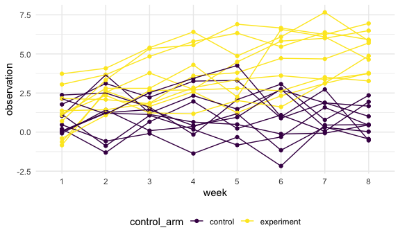

hw5
================
Yubei Liang
11/12/2020

# Problem 2

## tidy the data

``` r
path_df <- 
  tibble(
    path = list.files("data/lda_data")
    ) %>% 
  mutate(
    path  = str_c("data/lda_data/", path),
    data  = map(.x = path, ~read_csv(.x)),
    path = str_sub(path, 15,-5)
    ) %>% 
  separate(path, into = c("control_arm", "subject_ID"), sep = "_") %>% 
  mutate(
    control_arm = str_replace(control_arm, "con", "control"),
    control_arm = str_replace(control_arm, "exp", "experiment")
  ) %>% 
  unnest(data) %>% 
  pivot_longer(
    week_1:week_8,
    names_to = "week",
    values_to = "observation"
  ) %>% 
  mutate(
    week = str_sub(week, -1)
  )

head(path_df)
```

    ## # A tibble: 6 x 4
    ##   control_arm subject_ID week  observation
    ##   <chr>       <chr>      <chr>       <dbl>
    ## 1 control     01         1            0.2 
    ## 2 control     01         2           -1.31
    ## 3 control     01         3            0.66
    ## 4 control     01         4            1.96
    ## 5 control     01         5            0.23
    ## 6 control     01         6            1.09

## spaghetti plot

``` r
path_df %>% 
  ggplot(aes(x = week, y = observation, group = interaction(control_arm, subject_ID), color = control_arm)) +
  geom_point() +
  geom_line()
```


Comment: Subjects of control group (purple) reach nearly the same values
in week 8 as in week 1. However, observations from experimental group
(yellow) increase overall from range (-1.25, 3.75) to range (3.15, 7.5).
Therefore, there is a significant difference in performance of control
group v.s. experimental group.
