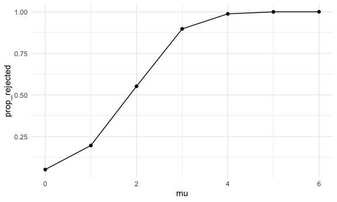

hw5
================
Yubei Liang
11/12/2020

# Problem 2

## tidy the data

``` r
path_df <- 
  tibble(
    path = list.files("data/lda_data")
    ) %>% 
  mutate(
    path  = str_c("data/lda_data/", path),
    data  = map(.x = path, ~read_csv(.x)),
    path = str_sub(path, 15,-5)
    ) %>% 
  separate(path, into = c("control_arm", "subject_ID"), sep = "_") %>% 
  mutate(
    control_arm = str_replace(control_arm, "con", "control"),
    control_arm = str_replace(control_arm, "exp", "experiment")
  ) %>% 
  unnest(data) %>% 
  pivot_longer(
    week_1:week_8,
    names_to = "week",
    values_to = "observation"
  ) %>% 
  mutate(
    week = str_sub(week, -1)
  )

head(path_df)
```

    ## # A tibble: 6 x 4
    ##   control_arm subject_ID week  observation
    ##   <chr>       <chr>      <chr>       <dbl>
    ## 1 control     01         1            0.2 
    ## 2 control     01         2           -1.31
    ## 3 control     01         3            0.66
    ## 4 control     01         4            1.96
    ## 5 control     01         5            0.23
    ## 6 control     01         6            1.09

## spaghetti plot

``` r
path_df %>% 
  ggplot(aes(x = week, y = observation, group = interaction(control_arm, subject_ID), color = control_arm)) +
  geom_point() +
  geom_line()
```


Comment: Subjects of control group (purple) reach nearly the same values
in week 8 as in week 1. However, observations from experimental group
(yellow) increase overall from range (-1.25, 3.75) to range (3.15, 7.5).
Therefore, there is a significant difference in performance of control
group v.s. experimental group.

# Problem 3

## 5000 simulations for mu = {0, 1, 2, 3, 4, 5, 6}

``` r
sim_ttest = function(mu, num = 30, sigma = 5) {
  sim_data = tibble(
    x = rnorm(n = num, mean = mu, sd = sigma)
  ) 
  
  ttest = t.test(sim_data, mu = 0, conf.level = 0.95) %>% 
    broom::tidy()
  
  sim_data %>%
    summarise(
      mean = mean(x)
    ) %>% 
    mutate(
      p_value = pull(ttest, p.value),
      test_result = if(p_value < 0.05){1}
                    else{0}
    )
}

sim_results = 
  tibble( mu = c(0, 1, 2, 3, 4, 5, 6)) %>% 
  mutate(
    output_lists = map( .x = mu, ~ rerun(5000, sim_ttest(.x))),
    estimates = map(output_lists, bind_rows),
    prop_rejected = map(.x = estimates, ~(sum(.x$test_result))/nrow(.x))
    ) %>% 
  select(-output_lists)

head(sim_results)
```

    ## # A tibble: 6 x 3
    ##      mu estimates            prop_rejected
    ##   <dbl> <list>               <list>       
    ## 1     0 <tibble [5,000 × 3]> <dbl [1]>    
    ## 2     1 <tibble [5,000 × 3]> <dbl [1]>    
    ## 3     2 <tibble [5,000 × 3]> <dbl [1]>    
    ## 4     3 <tibble [5,000 × 3]> <dbl [1]>    
    ## 5     4 <tibble [5,000 × 3]> <dbl [1]>    
    ## 6     5 <tibble [5,000 × 3]> <dbl [1]>

## plot of rejection proportion v.s. mu = {0, 1, 2, 3, 4, 5, 6}

``` r
sim_results_1 <- sim_results %>% 
  unnest(prop_rejected) %>% 
  select(-estimates)

sim_results_1
```

    ## # A tibble: 7 x 2
    ##      mu prop_rejected
    ##   <dbl>         <dbl>
    ## 1     0        0.0514
    ## 2     1        0.196 
    ## 3     2        0.552 
    ## 4     3        0.897 
    ## 5     4        0.988 
    ## 6     5        1.00  
    ## 7     6        1

``` r
sim_results_1 %>% 
  unnest(prop_rejected) %>% 
  ggplot(aes(x = mu, y = prop_rejected)) +
  geom_point() +
  geom_line()
```



Comment: For data generated with mu = 0, the rejection proportion is
0.0486, which is smaller than confidence level 0.05. The line plot shows
that power of test increases from 0.0486 to almost 1 as mu deviates more
from true mean 0. Therefore, the power of test increases when effect
size increases.

## average estimate of mu v.s. true mean

``` r
sim_results_2 <- sim_results %>% 
  mutate(
    average_mean = map(.x = estimates, ~(sum(.x $ mean))/nrow(.x))
  ) %>% 
  unnest(average_mean) %>% 
  select(-c(estimates,prop_rejected))

sim_results_2
```

    ## # A tibble: 7 x 2
    ##      mu average_mean
    ##   <dbl>        <dbl>
    ## 1     0   -0.0000715
    ## 2     1    1.00     
    ## 3     2    1.97     
    ## 4     3    3.01     
    ## 5     4    4.01     
    ## 6     5    5.00     
    ## 7     6    5.98

``` r
sim_results_3 <- sim_results %>% 
  mutate(
    estimates_filtered = map(.x = estimates, ~filter(.x, test_result == 1)),
    average_mean_filtered = map(.x = estimates_filtered, ~(sum(.x $ mean))/nrow(.x))
  ) %>% 
  select(-c(estimates, prop_rejected, estimates_filtered)) %>% 
  unnest(average_mean_filtered)

sim_results_3
```

    ## # A tibble: 7 x 2
    ##      mu average_mean_filtered
    ##   <dbl>                 <dbl>
    ## 1     0                0.0443
    ## 2     1                2.25  
    ## 3     2                2.60  
    ## 4     3                3.19  
    ## 5     4                4.04  
    ## 6     5                5.00  
    ## 7     6                5.98

``` r
ggplot() +
  geom_line(data = sim_results_2, aes(x = mu, y = average_mean, color = "black")) +
  geom_line(data = sim_results_3, aes(x = mu, y = average_mean_filtered, color = "blue")) +
  ggtitle("Estimated Mu of 5000 Simulations Compared with Rejected Simulations") +
  scale_color_discrete(name = "simulations", labels = c("5000 simulations", "rejected simulations only"))
```


Comment: For mu = 0, the sample average means of rejected simulations is
slightly smaller than the sample average means of 5000 simulations. For
mu = {1,2}, the sample average means of rejected simulations are much
greater than the sample average means of 5000 simulations. As mu
increases from 1 to 6, the difference between average means comes to 0.

In explain, for mu = 1, simulations with means greater than 1 are more
likely to be rejected compared to simulations with means smaller than 1.
The reason is that our null hypothesis takes mu = 0, which is smaller
than mu in most of our alternative hypotheses. As true mean increases
from 1 to 6, the power of test increases, thus the rejected simulations
have average mean very close to the true mean.
